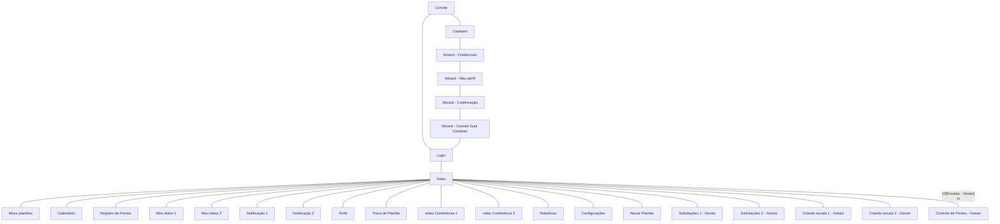

# Protótipos de Interface com o Usuário

## Link do protótipo no Figma:
https://www.figma.com/design/4cNTlYGnvNb8xBEZYjj6mK/PDS-WEB---Pulso?node-id=0-1&t=7mnDq0poN3F4xAFn-1

## Mapa do Site

> Obs.: propõem-se a utilização de alguma ferramenta que possibilite a representação textual do diagrama. como o seguinte exemplo:

## Telas Gerais:
> Obs.: telas em desenvolvimento.

### A. Tela 1: Login

### B. Tela 2: Credenciais

### C. Tela 3: Convite Guia Condutor

### D. Tela 4: Notificações 1

### E. Tela 5: Notificações 2

### F. Tela 6: Perfil

### G. Tela 7: Meus plantões

### H. Tela 8: Ver meu plantão

### I. Tela 9: Plantões extras

### J. Tela 10: Calendário

### K. Tela 11: Videoconferência 1

### L. Tela 12: Videoconferência 2

### M. Tela 13: Relatório

### N. Tela 14: Meu diário 1

### O. Tela 15: Meu diário 2

### P. Tela 16: Configurações

## Telas dos Médicos
> Obs.: telas em desenvolvimento.

### A. Tela 1: Meu perfil (Médico)

### B. Tela 2: Confirmação

### C. Tela 3: Página Inicial

### D. Tela 4: Troca de plantões

### E. Tela 5: Ponto

### F. Tela 8: Detalhes da sugestão

## Telas do Gestor
> Obs.: telas em desenvolvimento.

### A. Tela 1: Meu perfil (Gestor)

### B. Tela 2: Confirmação

### C. Tela 3: Página Inicial

### D. Tela 4: Escalas

### E. Tela 5: Ver Escala

### F. Tela 6: Criando escala

### G. Tela 7: Criando plantão

### H. Tela 8: Solicitações 1

### I. Tela 9: Solicitações 2

### J. Tela 10: Controle de pontos

